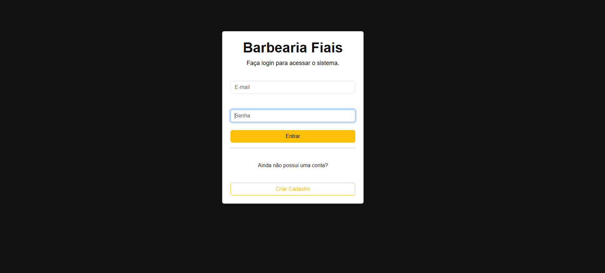
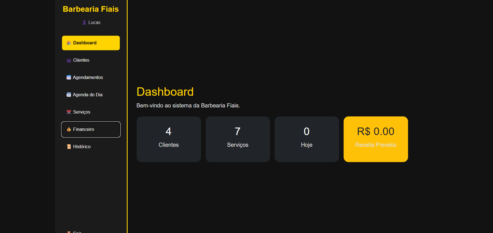
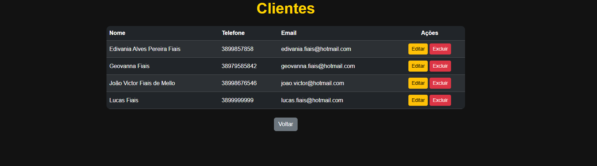
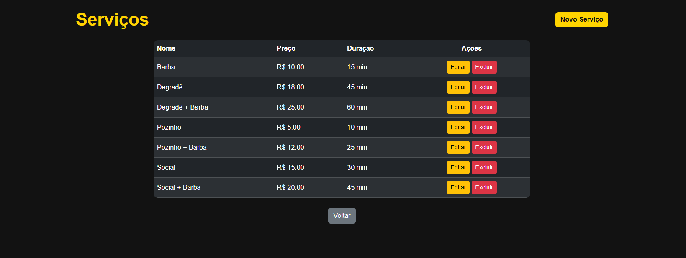
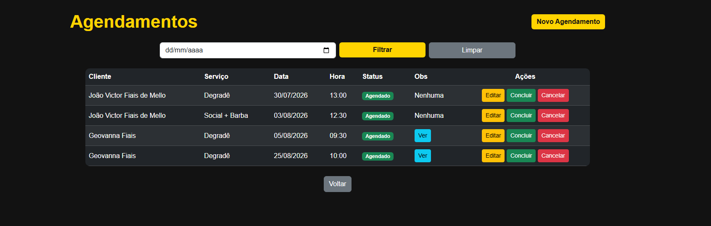
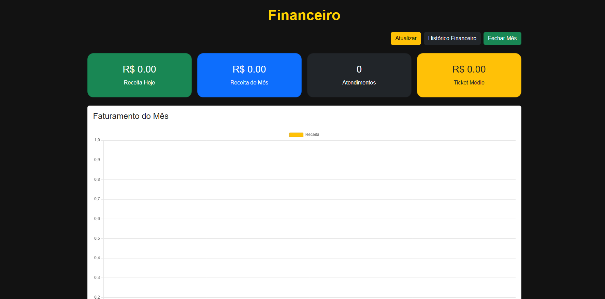
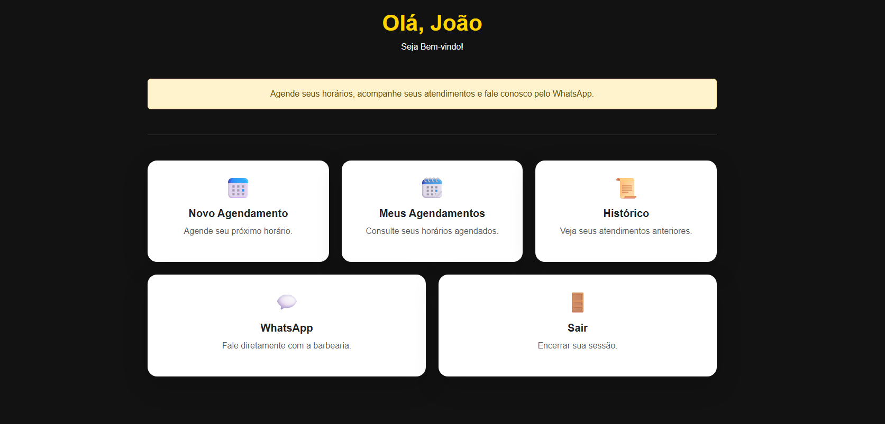

# Barbearia Fiais

Sistema web para gerenciamento de uma barbearia, desenvolvido como projeto de portfólio com foco em desenvolvimento web, banco de dados e autenticação.

## Sobre o projeto

O projeto foi desenvolvido a partir de uma situação real do ramo de barbearia, buscando centralizar tarefas como gerenciamento de clientes, serviços, agendamentos e controle financeiro em um único sistema.

Além de solucionar um problema de organização, o projeto serviu para aplicar na prática conhecimentos de desenvolvimento web, banco de dados, autenticação, responsividade e versionamento de código.

## Funcionalidades

### Área administrativa

- Login e autenticação de usuários
- Cadastro, edição e exclusão de clientes
- Cadastro, edição e exclusão de serviços
- Criação e gerenciamento de agendamentos
- Consulta de horários disponíveis
- Agenda do dia
- Controle financeiro
- Histórico de atendimentos
- Histórico financeiro

### Área do cliente

- Cadastro de conta
- Login
- Criação de agendamentos
- Consulta dos próprios agendamentos
- Edição e cancelamento de agendamentos
- Histórico de atendimentos
- Acesso ao WhatsApp da barbearia

## Demonstração

### Login



### Dashboard



### Clientes



### Serviços



### Agendamentos



### Financeiro



### Painel do Cliente



## Tecnologias

- Python
- Flask
- SQLAlchemy
- SQLite
- PostgreSQL
- HTML5
- CSS3
- JavaScript
- Bootstrap
- Git
- GitHub

## Como executar localmente

### Pré-requisitos

- Python 3.12 ou superior
- Git

### 1. Clone o repositório

```bash
git clone https://github.com/Lfiaxs/barbershop-system.git
```
### 2. Acesse a pasta do projeto

```bash
cd barbershop-system
```
### 3. Crie um ambiente virtual

```bash
python -m venv venv
```
### 5. Ative o ambiente virtual

```bash
No Windows:
venv\Scripts\activate
No Linux/macOS:
source venv/bin/activate
```

### 6. Instale as dependências

```bash
pip install -r requirements.txt
```

### 7. Execute o sistema

```bash
python run.py
```

Após iniciar o servidor, acesse no navegador:
http://127.0.0.1:5000
